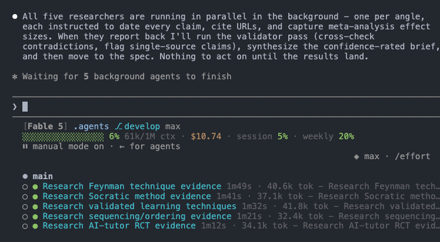
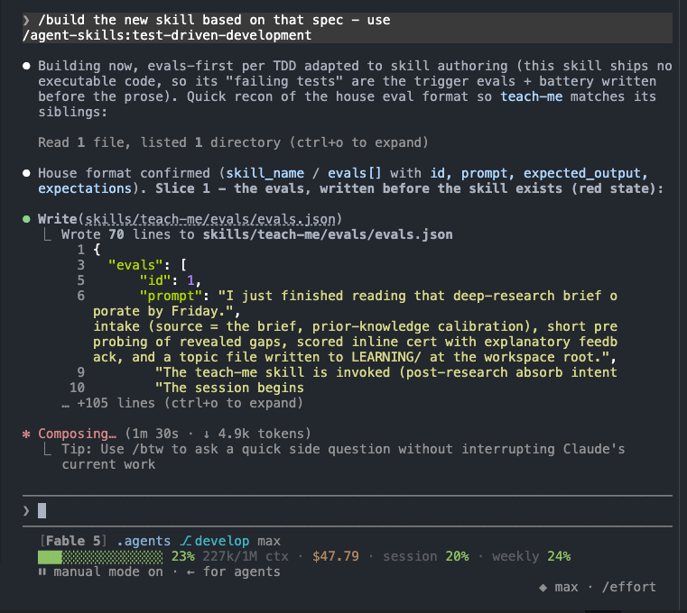
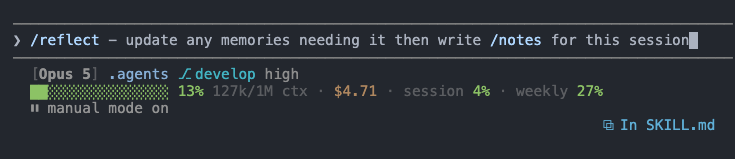
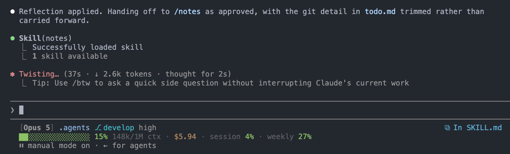
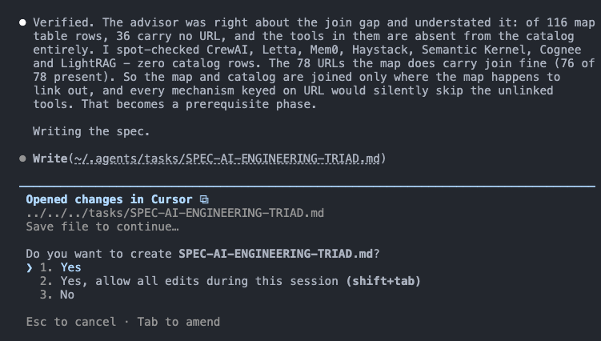

# `~/.agents` - agent skills, subagents, commands, and claude code configs


This repo contains my set of vendor-neutral "global" agent skills, and a `SPEC-CLAUDE.md`
file that outlines my standard claude code setup. 
All skills in this repo follow the "open agents standard" which is compatible with claude code 
and most other common agent frameworks. 
More info on the open agents specs:
https://github.com/oracle/agent-spec
https://oracle.github.io/agent-spec/26.1.2/

The `sync-skills.sh` script 
installs this repo's skills, agents, and commands safely into `~/.claude` as 
symlinks, and any existing skill with a matching name is ignored.

> **[`SPEC-CLAUDE.md`](SPEC-CLAUDE.md) outlines my main claude code configs** - the
> spec for a Claude Code `~/.claude/` folder that this `~/.agents/` repo assembles 
> into. Start there when setting up; this README covers the
> skills/agents/commands that are installed into that agent harness.

## Design principles

**Surface the agent and session internals.** Which model is working, how much context 
is left, what a session has cost, which branch the work is on, what background
subagents are doing. All of it stays visible while the work happens rather than
being abstracted away, making it easier to redirect a
session before it goes off track. 

**Configs gate behavior; prose does not.** A subagent told to be read-only
but allowed `Bash` will edit files, so advisory agents get a read-only `tools:`
allowlist instead of a verbal agreement and hope. 

**Checkers run outside the model.** A checklist applied by the model that wrote
the code is the model grading its own homework. So the skills whose output is
judged mechanically ship a stdlib checker that exits non-zero on failure:
`slop_check.py` for machine-writing tells, `docker_check.py` for compose
host-escape grants, `django_check.py` for the fail-open DRF defaults,
`unicode_smuggle_check.py` for instructions hidden in invisible characters.
Anything solely requiring judgment stays in the prose.

**Knowledge is maintained as data, not remembered prose.** The `ai-engineering` skill
keeps one row per source in `resources/catalog.tsv` with the date each claim was
verified, and `link-ledger.md` is generated from it rather than hand-edited. An
undated claim cannot be told apart from a half-remembered one, so teaching the
corpus a new category is a data edit rather than a skill rewrite. Separation of storage 
and compute, sort of. 

**Non-destructive by default.** Retired work is archived rather than deleted,
finished plan items move to dated cold storage instead of vanishing, `/reflect`
proposes memory updates and waits for approval before writing, and a sync that finds
divergence stops and asks rather than resolving it. Preventing mistakes is less expensive 
than fixing them.

## Skills in action

Screenshots from real sessions.

**Status line.** `statusline.sh` renders model, cwd, branch, reasoning effort,
context used, tokens, session cost, and rate-limit consumption on every prompt;
`subagent-statusline.sh` adds one row per running background task. Setup:
copy both scripts from [`SPEC-CLAUDE.md`](SPEC-CLAUDE.md) §9 to `~/.claude/`,
make them executable, and wire them into `settings.json`'s `statusLine` /
`subagentStatusLine`.


**`deep-research` → `teach-me`.** Parallel researchers fan out one per angle,
dating and citing claims; the skill is then built spec-first, with trigger
evals written before the prose exists.





**`reflect` → `notes`.** `/reflect` reconciles truth and waits for approval
before writing; only then does `/notes` file the session.




**`meta-loop` + `advisor`.** A premium critic consulted off the hot path; its
findings get checked against the data before the main agent acts on them.




## Layout

```
~/.agents/
  skills/             # one directory per skill, each with a SKILL.md
    <skill-name>/SKILL.md
  agents/             # one .md per subagent (YAML frontmatter + system prompt)
  commands/           # one .md per slash command
  sync-skills.sh      # assembles ~/.claude/{skills,agents,commands} as a per-device view
  tests/              # station-level suites (e.g. the deny-bash-file-writes hook, 70 cases)
  SPEC.md             # living spec: current state and scope
  SPEC-CLAUDE.md      # seed spec for the surrounding Claude Code station
  tasks/plan.md       # active plan, backlog, and dev docs
  tasks/todo.md       # next actions and session handoff
  tasks/completed/    # dated cold storage, immutable once written
  __archive/          # gitignored soft-deletions of retired root docs
  README.md           # this file, including the catalog and architecture
  AGENTS.md           # rules and cautions for agents working in here
```

This tree holds **own** tooling only. Upstream and third-party skills come from
installed plugins such as `agent-skills`, never from here.

## Skills catalog

What ships here. Each entry's own file is authoritative: a skill's frontmatter
description is its trigger contract and its body is the workflow.

### Skills

| Skill | What it does |
|---|---|
| `agent-mail` | Templated markdown messaging between agents via `inbox/` folders |
| `ai-engineering` | Choosing an AI/agent stack, and the state of a given tool, from a dated catalog |
| `ai-agent-project-scaffold` | Intake-driven scaffolding of an AI project or subsystem |
| `ai-engineering-update` | The write path for that catalog: discover, verify, record |
| `ai-slop-magic-eraser` | Strips machine-writing tells from prose, then corrects what was invented |
| `cover-me` | Spawns the `supervisor` peer to scrutinize in-flight work |
| `deep-research` | Multi-angle web research: parallel researchers, cross-validated, cited |
| `django` | Build, operate and harden Django and DRF |
| `docker` | Scaffold, operate and harden containers |
| `frontend-aesthetics` | Raise UI past the defaults that read as AI slop |
| `hi` | Session-start orientation, read-only |
| `meta-loop` | Orchestration: plan, fan out, verify, synthesize |
| `my-security-review-checklist` | Pre-merge security gate for agent tooling |
| `notes` | End-of-session documentation sweep into the living docs |
| `o-o-d-a-loop` | Thought partner for a live decision under uncertainty |
| `obsidian` | Obsidian markdown standard plus a per-vault authoring workflow |
| `obsidian-kg` | Offline knowledge graph over a wikilink vault |
| `okf-kg` | Offline knowledge graph over an OKF vault |
| `reflect` | End-of-session truth reconciliation into memory |
| `repo-device-sync` | Multi-device git sync ritual |
| `skill-authoring` | House profile for authoring and auditing agent tooling |
| `teach-me` | Teaches a topic and certifies understanding |

### Subagents (`agents/*.md`)

| Subagent | What it does |
|---|---|
| `advisor` | Consulted critic for `meta-loop`: strategy, decomposition, risk, taste |
| `ai-engineer` | Fresh-context builder for heavy delegated AI and agent work |
| `my-security-reviewer` | Fresh-context reviewer applying the checklist to staged diffs |
| `researcher` | Source-cited researcher for one bounded angle; the `deep-research` worker |
| `supervisor` | Read-only peer watching in-flight work for drift and landmines |

### Commands (`commands/*.md`)

| Command | What it routes |
|---|---|
| `/agent-mail` | One agent-mail action (send/read/list/reply); "team" points to native Agent Teams |
| `/my-security-review` | The agent-tooling security review; dispatches `my-security-reviewer` for depth |
| `/reflect` | Truth reconciliation (propose → user gate → apply), then hands to `/notes` |
| `/supervisor` | Spawns the supervisor peer (alias of `cover-me`) |
| `/spec` `/plan` `/build` `/test` `/review` `/ship` `/code-simplify` | Bare-name aliases delegating to the namespaced agent-skills plugin skills (plugin commands register as `/agent-skills:*`; these give the short names) |

`sync-skills.sh` links all of the above into each device's
`~/.claude/{skills,agents,commands}`. Upstream skills come from the five
installed plugins listed in `SPEC-CLAUDE.md` §3, and evals run through the
skill-creator plugin's `run_eval.py`.

## Architecture

The sync model, and what it guarantees.

### The per-device view

[Layout](#layout) above is the repo itself. What `sync-skills.sh` builds on
each machine is a separate thing:

```
~/.claude/{skills,agents,commands}/   ← per-device VIEW (real dirs, NOT synced)
  <name> -> ~/.agents/<tree>/<name>    (leaf symlink per global entry)
  <local-entry>                         (real; device-only, never committed here)
```

Upstream skills are **not** in this tree. They come from the installed
`agent-skills` plugin and load from its own marketplace cache, covered under
Ownership and isolation below.

### Data flow: how an entry reaches Claude Code

1. An entry is authored in this repo: a skill dir `skills/<name>/SKILL.md`, a
   subagent `agents/<name>.md`, or a command `commands/<name>.md`.
2. `sync-skills.sh` runs on a device and builds each `~/.claude/<tree>` as a **view**:
   - links every global entry (skill dirs containing `SKILL.md`; `*.md` for
     agents/commands),
   - **skips** any name that already exists as a real local entry (local wins),
   - **prunes** dangling symlinks (globals removed upstream),
   - **refreshes** existing global symlinks in case a target path changed.
3. Claude Code discovers them from `~/.claude/{skills,agents,commands}` and exposes
   skills/commands as `/<name>` and subagents as agent types. (Skills hot-reload;
   newly synced agents/commands may need a session reload to register.)

`~/.claude/{skills,agents,commands}` are real per-device directories holding
one leaf symlink per global entry plus any device-local entries created
directly there (never shared, never committed here). Only `~/.agents` is
synced across machines - source of truth = `~/.agents/skills`; per-device
view = `~/.claude/skills`.

### `sync-skills.sh` key behaviors

- `set -euo pipefail`; supports `--dry-run`.
- **Bridges three trees** via generalized helpers (`link_one`, `prune_dangling`,
  `sync_skill_dirs` for skill dirs, `sync_md_files` for agent/command `.md` files):
  `skills/`→`~/.claude/skills`, `agents/`→`~/.claude/agents`,
  `commands/`→`~/.claude/commands`. Same guarantees applied per tree.
- **Refuses to run** if any target `~/.claude/<tree>` is still an old *parent-level*
  symlink (legacy setup) - prints how to convert it (`rm` the link, `mkdir` a real
  dir). `rm` on a symlink removes only the link; `~/.agents` is untouched.
- **Writes relative targets** (`../../.agents/skills/<name>`) whenever `~/.agents`
  and `~/.claude` are siblings, falling back to absolute only if they are not.
  `~/.claude` is itself a git repo that tracks these pointers, so the set of wired
  skills is visible in version control; a relative target keeps this machine's home
  directory out of that history and lets the links survive a clone under any home.
- Idempotent and non-destructive to locals - safe to re-run any time.

### Branch model

- `develop` - default / working branch. All changes land here first.
- `main` - stable. Fast-forwarded from `develop` (`git merge develop --ff-only`).
- Remote: `origin` - a private GitHub repo.

### Ownership and isolation

**Nothing external owns `~/.agents`.** It is a standalone git repo with no
`plugin.json`, `marketplace.json`, or `package.json`, and third-party skill
sources do not write into it (verified 2026-06-28):

- The `agent-skills@addy-agent-skills` plugin (`addyosmani/agent-skills`) is now
  **installed** (as of 2026-06-28; see `installed_plugins.json`). It loads from its
  own cache under `~/.claude/plugins/cache/addy-agent-skills/...` and exposes
  namespaced `agent-skills:*` entries - it never reads from or writes into
  `~/.agents`. The repo no longer vendors copies of its skills.
- The only `rm`/`cp` in that package's hooks operate on its own private `$CACHE`
  dir, never on user skills.
- Installed plugins (e.g. `claude-mem`) live under
  `~/.claude/plugins/cache/...`, fully isolated from this repo.

So updating or reinstalling a third-party plugin cannot mutate or delete
anything here. The only thing that edits `~/.claude/skills` is `sync-skills.sh`,
which adds links and prunes *dangling* ones; real skill directories are never
removed, and everything is recoverable from git history.

### Conventions

- Skill dirs may carry their own `scripts/`, `templates/`, `tests/`, `references/`,
  `resources/`, and even a local `SPEC.md` (e.g. `agent-mail` has
  scripts/templates/tests; `obsidian` has `references/`, a stdlib `tests/` suite, and
  now `scripts/index_vault.py`; `ai-engineering` has `scripts/ledger.py` +
  `resources/` data).
- **Data-driven skills with a deterministic engine.** `ai-engineering` is more than
  prose: `scripts/ledger.py` (stdlib, deterministic, idempotent) is the engine, and
  its knowledge lives in **data** - `resources/catalog.tsv` (source of truth, one row
  per URL, 436 URLs), `rules.tsv` (domain→section auto-classify), `seed-sections.tsv`
  (repo→section). `resources/link-ledger.md` is **generated** by `ledger.py render` -
  never hand-edit it. Teaching a new category is a data edit, not a code change. The
  `ai-engineering-update` skill owns the discovery+freshness loop around this engine.
- `.DS_Store` is git-ignored. `__archive*/` is also git-ignored - it holds
  non-destructive archive copies of retired root docs (soft-deletion; never
  hard-delete).

## Setup and daily use

On a new machine:

```bash
git clone <this-repo> ~/.agents
# make ~/.claude/skills a real dir if it isn't already:
[ -L ~/.claude/skills ] && rm ~/.claude/skills   # removes the link only
mkdir -p ~/.claude/skills
bash ~/.agents/sync-skills.sh
```

[`SPEC-CLAUDE.md`](SPEC-CLAUDE.md) covers the rest of the station: plugins, CLI
dependencies, global settings, and hooks.

To add or change a skill, edit it under `skills/<name>/` (a `SKILL.md` is
required), then commit to `develop` and re-run the assembler. Skills hot-reload;
new subagents and commands need a session restart before they register.
Device-local skills live directly in `~/.claude/skills/` and the sync never
touches them.

Secrets stay out: the repo is private, but it is still a git repo.

## Documentation

[`CLAUDE.md`](CLAUDE.md) has the lifecycle these follow.

- [`SPEC.md`](SPEC.md) - what this repo is, its active scope and invariants.
- [`SPEC-CLAUDE.md`](SPEC-CLAUDE.md) - seed spec for the surrounding Claude Code
  station; follow it when setting up a device.
- [Skills catalog](#skills-catalog) and [Architecture](#architecture) - both in
  this file.
- [`tasks/plan.md`](tasks/plan.md) - active plan, backlog, and dev docs.
- [`tasks/todo.md`](tasks/todo.md) - next actions and session handoff.
- [`tasks/completed/`](tasks/completed/) - dated cold storage, append-once and
  immutable after the day, plus retired feature specs as whole dated files.