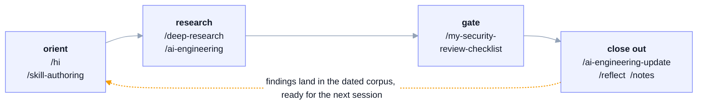

# `~/.agents` - agent skills, subagents, and commands

The source of truth for a set of Claude Code skills, subagents, and slash
commands: 22 skills, 5 subagents, 11 commands, plus the station config that
surrounds them. `sync-skills.sh` assembles them into `~/.claude` as a
per-device view of symlinks, so the same tooling is available in every session
on every machine that clones this repo.

> Changes here propagate to **every machine and every session**. Treat this as a
> source of truth - see [`AGENTS.md`](AGENTS.md) before editing.

## Design principles

Five rules decide most of what is in here and how it is built, and each one is
enforced somewhere concrete.

**Surface the internals.** Which model is answering, how much context is left,
what a session has cost, which branch the work lands on, what a background
subagent is doing. All of it stays visible while the work happens rather than
being reconstructed afterward, which is what makes it possible to redirect a
session before it goes wrong. The status lines are the literal case
([`SPEC-CLAUDE.md`](SPEC-CLAUDE.md) §9); the same instinct drives skills that
read repo state before acting and name their assumptions out loud.

**Capability gates behavior; prose does not.** A subagent told to be read-only
but handed `Bash` will edit files, so advisory agents get a read-only `tools:`
allowlist instead of a promise. Likewise the agent kept authoring files through
shell heredocs until a `PreToolUse` hook denied it outright. Where a rule has to
hold, it is wired into the harness rather than written down and hoped for.

**Checkers run outside the model.** A checklist applied by the model that wrote
the code is the model grading its own homework. So the skills whose output is
judged mechanically ship a stdlib checker that exits non-zero on failure:
`slop_check.py` for machine-writing tells, `docker_check.py` for compose
host-escape grants, `django_check.py` for the fail-open DRF defaults,
`unicode_smuggle_check.py` for instructions hidden in invisible characters.
Anything requiring judgment stays in the prose, where a person can argue with
it.

**Knowledge is dated data, not remembered prose.** The `ai-engineering` corpus
keeps one row per source in `resources/catalog.tsv` with the date each claim was
verified, and `link-ledger.md` is generated from it rather than hand-edited. An
undated claim cannot be told apart from a half-remembered one, so teaching the
corpus a new category is a data edit rather than a rewrite.

**Non-destructive by default.** Retired work is archived rather than deleted,
finished plan items move to dated cold storage instead of vanishing, `/reflect`
proposes a slate and waits for approval before writing, and a sync that finds
divergence stops and asks rather than resolving it. The point is that recovering
from a mistake should not require having caught it at the time.

## Skills in action

Screenshots from real sessions. The diagram is the shape most of them take,
simplified to four stages. The return edge is the part worth noticing:
`ai-engineering` carries a dated corpus of what has been verified, and
`ai-engineering-update` writes back into it at closeout, so a session ends by
leaving the next one better informed rather than by forgetting.



Nothing forces the full chain and most sessions touch two or three of these.
The ordering only matters where it is load-bearing: research before choosing,
the security gate before merge, `/reflect` before `/notes`. The screenshots
below follow the same arc, starting with the status line and ending with a
pattern that drops into any stage.

**The status line: the internals, on screen.** Two scripts render a HUD on
every prompt. The main one is always there; the second appears only while
background work is running.

`statusline.sh` renders two lines:

| Segment | Shows | In the screenshot |
|---|---|---|
| `[Fable 5]` | Model answering right now | Fable 5 |
| `.agents` | Working directory, basename only | `.agents` |
| `⎇ develop` | Git branch; hidden outside a repo, short SHA when detached | `develop` |
| `max` | Reasoning effort, when reported | `max` |
| bar + `23%` | Context used, green to yellow at 70%, red at 90% | 23%, green |
| `226k/1M ctx` | Tokens used against the window | 226k of 1M |
| `$47.79` | Cost so far this session | $47.79 |
| `session 20%` | Five-hour rate-limit consumption | 20% |
| `weekly 24%` | Seven-day rate-limit consumption | 24% |

Every segment is optional and drops out silently when its field is absent, so
early in a session, or outside a git repo, the line is simply shorter. Rate
limits show `--` until the first API response reports them.


*The main status line. Identity on line one, telemetry on line two. The
`manual mode on` line below it is Claude Code's own, not part of this script.*

`subagent-statusline.sh` adds one row per running background task, because the
main status line's input JSON carries no task or subagent fields and cannot
show them. Each row is a status icon (running, idle, done, error), the agent's
name, elapsed time, tokens consumed, and a truncated description.


*Five researchers running in parallel during a deep-research pass, each with
its own runtime and token count while the work is still in flight.*

**Setting it up.** Both scripts need `jq`. Copy them from
[`SPEC-CLAUDE.md`](SPEC-CLAUDE.md) §9 to `~/.claude/statusline.sh` and
`~/.claude/subagent-statusline.sh`, make them executable, then point
`~/.claude/settings.json` at them:

```json
"statusLine":         { "type": "command", "command": "bash ~/.claude/statusline.sh" },
"subagentStatusLine": { "type": "command", "command": "bash ~/.claude/subagent-statusline.sh" }
```

**`deep-research`: parallel researchers, then a cited brief.** The session
that produced `teach-me`: the charter names the goal and the skills to route
through, then researcher agents fan out in parallel, one per angle, each
dating claims and capturing meta-analysis effect sizes.


*The charter that opened the session, naming the goal and the skills to route
through before any work started.*


*The fan-out announced before results land: one researcher per angle, each
required to date every claim, with the validate and synthesis passes already
named.*

**`teach-me`: built spec-first, evals-first.** The build writes the trigger
evals and convergence battery before the skill prose exists (TDD adapted to
skill authoring), against the spec and evidence brief from the research
above.


*Trigger evals written before the skill prose exists, which is test-driven
development applied to skill authoring.*

**`reflect` then `notes`: closing out in two passes.** `/reflect` reconciles
truth - promoting durable knowledge to memory and correcting claims the
session invalidated - and stops for approval before writing any of it. Only
then does it hand off to `/notes`, the documentation sweep. Two skills rather
than one, because ratifying what is true and filing what was done are separate
jobs with separate failure modes.


*Invoking the closeout, with the status line showing the session that is about
to be reconciled.*


*The handoff after the slate was approved: reflect reports what it applied, then
loads `/notes` to file the session.*

**`meta-loop` + `advisor`: a premium critic consulted off the hot path.** Not
tied to one stage - an Opus 5 session hands one specific question to the
fable-pinned `advisor` subagent, which grounds itself in the ai-engineering
resources before answering; the main agent then verifies the advisor's claim
against the actual data before acting on it.


*The advisor grounding itself in the corpus before answering, on its own pinned
model and its own context, separate from the session that called it.*


*The main agent checking the advisor's finding against the data before acting on
it, rather than taking it on trust.*

## Layout

```
~/.agents/
  skills/             # one directory per skill, each with a SKILL.md
    <skill-name>/SKILL.md
  agents/             # one .md per subagent (YAML frontmatter + system prompt)
  commands/           # one .md per slash command
  sync-skills.sh      # assembles ~/.claude/{skills,agents,commands} as a per-device view
  tests/              # station-level suites (e.g. the deny-bash-file-writes hook, 70 cases)
  SPEC.md             # living spec: current state and scope
  SPEC-CLAUDE.md      # seed spec for the surrounding Claude Code station
  tasks/plan.md       # active plan, backlog, and dev docs
  tasks/todo.md       # next actions and session handoff
  tasks/completed/    # dated cold storage, immutable once written
  __archive/          # gitignored soft-deletions of retired root docs
  README.md           # this file, including the catalog and architecture
  AGENTS.md           # rules and cautions for agents working in here
```

This tree holds **own** tooling only. Upstream and third-party skills come from
installed plugins such as `agent-skills`, never from here.

## Skills catalog

What ships here. Each entry's own file is authoritative: a skill's frontmatter
description is its trigger contract and its body is the workflow.

### Skills

| Skill | What it does |
|---|---|
| `agent-mail` | Templated markdown messaging between agents via `inbox/` folders |
| `ai-engineering` | Choosing an AI/agent stack, and the state of a given tool, from a dated catalog |
| `ai-agent-project-scaffold` | Intake-driven scaffolding of an AI project or subsystem |
| `ai-engineering-update` | The write path for that catalog: discover, verify, record |
| `ai-slop-magic-eraser` | Strips machine-writing tells from prose, then corrects what was invented |
| `cover-me` | Spawns the `supervisor` peer to scrutinize in-flight work |
| `deep-research` | Multi-angle web research: parallel researchers, cross-validated, cited |
| `django` | Build, operate and harden Django and DRF |
| `docker` | Scaffold, operate and harden containers |
| `frontend-aesthetics` | Raise UI past the defaults that read as AI slop |
| `hi` | Session-start orientation, read-only |
| `meta-loop` | Orchestration: plan, fan out, verify, synthesize |
| `my-security-review-checklist` | Pre-merge security gate for agent tooling |
| `notes` | End-of-session documentation sweep into the living docs |
| `o-o-d-a-loop` | Thought partner for a live decision under uncertainty |
| `obsidian` | Obsidian markdown standard plus a per-vault authoring workflow |
| `obsidian-kg` | Offline knowledge graph over a wikilink vault |
| `okf-kg` | Offline knowledge graph over an OKF vault |
| `reflect` | End-of-session truth reconciliation into memory |
| `repo-device-sync` | Multi-device git sync ritual |
| `skill-authoring` | House profile for authoring and auditing agent tooling |
| `teach-me` | Teaches a topic and certifies understanding |

### Subagents (`agents/*.md`)

| Subagent | What it does |
|---|---|
| `advisor` | Consulted critic for `meta-loop`: strategy, decomposition, risk, taste |
| `ai-engineer` | Fresh-context builder for heavy delegated AI and agent work |
| `my-security-reviewer` | Fresh-context reviewer applying the checklist to staged diffs |
| `researcher` | Source-cited researcher for one bounded angle; the `deep-research` worker |
| `supervisor` | Read-only peer watching in-flight work for drift and landmines |

### Commands (`commands/*.md`)

| Command | What it routes |
|---|---|
| `/agent-mail` | One agent-mail action (send/read/list/reply); "team" points to native Agent Teams |
| `/my-security-review` | The agent-tooling security review; dispatches `my-security-reviewer` for depth |
| `/reflect` | Truth reconciliation (propose → user gate → apply), then hands to `/notes` |
| `/supervisor` | Spawns the supervisor peer (alias of `cover-me`) |
| `/spec` `/plan` `/build` `/test` `/review` `/ship` `/code-simplify` | Bare-name aliases delegating to the namespaced agent-skills plugin skills (plugin commands register as `/agent-skills:*`; these give the short names) |

`sync-skills.sh` links all of the above into each device's
`~/.claude/{skills,agents,commands}`. Upstream skills come from the five
installed plugins listed in `SPEC-CLAUDE.md` §3, and evals run through the
skill-creator plugin's `run_eval.py`.

## Architecture

The sync model, and what it guarantees.

### The per-device view

[Layout](#layout) above is the repo itself. What `sync-skills.sh` builds on
each machine is a separate thing:

```
~/.claude/{skills,agents,commands}/   ← per-device VIEW (real dirs, NOT synced)
  <name> -> ~/.agents/<tree>/<name>    (leaf symlink per global entry)
  <local-entry>                         (real; device-only, never committed here)
```

Upstream skills are **not** in this tree. They come from the installed
`agent-skills` plugin and load from its own marketplace cache, covered under
Ownership and isolation below.

### Data flow: how an entry reaches Claude Code

1. An entry is authored in this repo: a skill dir `skills/<name>/SKILL.md`, a
   subagent `agents/<name>.md`, or a command `commands/<name>.md`.
2. `sync-skills.sh` runs on a device and builds each `~/.claude/<tree>` as a **view**:
   - links every global entry (skill dirs containing `SKILL.md`; `*.md` for
     agents/commands),
   - **skips** any name that already exists as a real local entry (local wins),
   - **prunes** dangling symlinks (globals removed upstream),
   - **refreshes** existing global symlinks in case a target path changed.
3. Claude Code discovers them from `~/.claude/{skills,agents,commands}` and exposes
   skills/commands as `/<name>` and subagents as agent types. (Skills hot-reload;
   newly synced agents/commands may need a session reload to register.)

`~/.claude/{skills,agents,commands}` are real per-device directories holding
one leaf symlink per global entry plus any device-local entries created
directly there (never shared, never committed here). Only `~/.agents` is
synced across machines - source of truth = `~/.agents/skills`; per-device
view = `~/.claude/skills`.

### `sync-skills.sh` key behaviors

- `set -euo pipefail`; supports `--dry-run`.
- **Bridges three trees** via generalized helpers (`link_one`, `prune_dangling`,
  `sync_skill_dirs` for skill dirs, `sync_md_files` for agent/command `.md` files):
  `skills/`→`~/.claude/skills`, `agents/`→`~/.claude/agents`,
  `commands/`→`~/.claude/commands`. Same guarantees applied per tree.
- **Refuses to run** if any target `~/.claude/<tree>` is still an old *parent-level*
  symlink (legacy setup) - prints how to convert it (`rm` the link, `mkdir` a real
  dir). `rm` on a symlink removes only the link; `~/.agents` is untouched.
- **Writes relative targets** (`../../.agents/skills/<name>`) whenever `~/.agents`
  and `~/.claude` are siblings, falling back to absolute only if they are not.
  `~/.claude` is itself a git repo that tracks these pointers, so the set of wired
  skills is visible in version control; a relative target keeps this machine's home
  directory out of that history and lets the links survive a clone under any home.
- Idempotent and non-destructive to locals - safe to re-run any time.

### Branch model

- `develop` - default / working branch. All changes land here first.
- `main` - stable. Fast-forwarded from `develop` (`git merge develop --ff-only`).
- Remote: `origin` - a private GitHub repo.

### Ownership and isolation

**Nothing external owns `~/.agents`.** It is a standalone git repo with no
`plugin.json`, `marketplace.json`, or `package.json`, and third-party skill
sources do not write into it (verified 2026-06-28):

- The `agent-skills@addy-agent-skills` plugin (`addyosmani/agent-skills`) is now
  **installed** (as of 2026-06-28; see `installed_plugins.json`). It loads from its
  own cache under `~/.claude/plugins/cache/addy-agent-skills/...` and exposes
  namespaced `agent-skills:*` entries - it never reads from or writes into
  `~/.agents`. The repo no longer vendors copies of its skills.
- The only `rm`/`cp` in that package's hooks operate on its own private `$CACHE`
  dir, never on user skills.
- Installed plugins (e.g. `claude-mem`) live under
  `~/.claude/plugins/cache/...`, fully isolated from this repo.

So updating or reinstalling a third-party plugin cannot mutate or delete
anything here. The only thing that edits `~/.claude/skills` is `sync-skills.sh`,
which adds links and prunes *dangling* ones; real skill directories are never
removed, and everything is recoverable from git history.

### Conventions

- Skill dirs may carry their own `scripts/`, `templates/`, `tests/`, `references/`,
  `resources/`, and even a local `SPEC.md` (e.g. `agent-mail` has
  scripts/templates/tests; `obsidian` has `references/`, a stdlib `tests/` suite, and
  now `scripts/index_vault.py`; `ai-engineering` has `scripts/ledger.py` +
  `resources/` data).
- **Data-driven skills with a deterministic engine.** `ai-engineering` is more than
  prose: `scripts/ledger.py` (stdlib, deterministic, idempotent) is the engine, and
  its knowledge lives in **data** - `resources/catalog.tsv` (source of truth, one row
  per URL, 436 URLs), `rules.tsv` (domain→section auto-classify), `seed-sections.tsv`
  (repo→section). `resources/link-ledger.md` is **generated** by `ledger.py render` -
  never hand-edit it. Teaching a new category is a data edit, not a code change. The
  `ai-engineering-update` skill owns the discovery+freshness loop around this engine.
- `.DS_Store` is git-ignored. `__archive*/` is also git-ignored - it holds
  non-destructive archive copies of retired root docs (soft-deletion; never
  hard-delete).

## Setup and daily use

On a new machine:

```bash
git clone <this-repo> ~/.agents
# make ~/.claude/skills a real dir if it isn't already:
[ -L ~/.claude/skills ] && rm ~/.claude/skills   # removes the link only
mkdir -p ~/.claude/skills
bash ~/.agents/sync-skills.sh
```

[`SPEC-CLAUDE.md`](SPEC-CLAUDE.md) covers the rest of the station: plugins, CLI
dependencies, global settings, and hooks.

To add or change a skill, edit it under `skills/<name>/` (a `SKILL.md` is
required), then commit to `develop` and re-run the assembler. Skills hot-reload;
new subagents and commands need a session restart before they register.
Device-local skills live directly in `~/.claude/skills/` and the sync never
touches them.

Secrets stay out: the repo is private, but it is still a git repo.

## Documentation

[`CLAUDE.md`](CLAUDE.md) has the lifecycle these follow.

- [`SPEC.md`](SPEC.md) - what this repo is, its active scope and invariants.
- [`SPEC-CLAUDE.md`](SPEC-CLAUDE.md) - seed spec for the surrounding Claude Code
  station; follow it when setting up a device.
- [Skills catalog](#skills-catalog) and [Architecture](#architecture) - both in
  this file.
- [`tasks/plan.md`](tasks/plan.md) - active plan, backlog, and dev docs.
- [`tasks/todo.md`](tasks/todo.md) - next actions and session handoff.
- [`tasks/completed/`](tasks/completed/) - dated cold storage, append-once and
  immutable after the day, plus retired feature specs as whole dated files.
